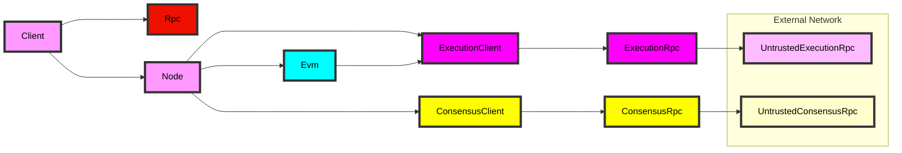

## Helios

[](https://github.com/a16z/helios/actions/workflows/test.yml) [](https://opensource.org/licenses/MIT) [](https://t.me/+IntDY_gZJSRkNTJj)

Helios is a fully trustless, efficient, and portable Ethereum light client written in Rust.

Helios converts an untrusted centralized RPC endpoint into a safe unmanipulable local RPC for its users. It syncs in seconds, requires no storage, and is lightweight enough to run on mobile devices.

The entire size of Helios's binary is 5.3Mb and should be easy to compile into WebAssembly. This makes it a perfect target to embed directly inside wallets and dapps.

## Installing

First install `heliosup`, Helios's installer:

```
curl https://raw.githubusercontent.com/a16z/helios/master/heliosup/install | bash
```

To install Helios, run `heliosup`.

## Testing

To ensure that Helios works as expected, we have a comprehensive test suite that you can run. Before running the tests, make sure to create a `.env` file in the root of the project directory. You can copy the contents of the `.env.example` file and fill in your own secrets.

To run all tests, use the following command:

```sh
cargo test-all
```

To run tests for an individual package, use this command, replacing <package-name> with the package you want to test:

```sh
cargo test -p <package-name>
```

## Usage

To run Helios, run the below command, replacing `$ETH_RPC_URL` with an RPC provider URL such as Alchemy or Infura:

```
helios --execution-rpc $ETH_RPC_URL
```

`$ETH_RPC_URL` must be an Ethereum provider that supports the `eth_getProof` endpoint. Infura does not currently support this. We recommend using Alchemy.

Helios will now run a local RPC server at `http://127.0.0.1:8545`.

Helios provides examples in the [`examples/`](./examples/) directory. To run an example, you can execute `cargo run -p helios --example <example_name>` from inside the helios repository.

Helios also provides documentation of its supported RPC methods in the [rpc.md](./rpc.md) file.

### Experiment

```
./docker/docker.sh
```

For the network that we will connect to, get a recent checkpoint, which is a beaconchain blockhash, rather than a execution block hash, so we don't get it from https://goerli.etherscan.io/blocks. Instead go to https://prater.beaconcha.in/ and get the blockhash for the first block in any finalised epoch that is no older than ~2 weeks old. For example at the time of writing, the first blockhash in epoch 197110 https://prater.beaconcha.in/epochs is 0x7beab8f82587b1e9f2079beddebde49c2ed5c0da4ce86ea22de6a6b2dc7aa86b which corresponds to https://prater.beaconcha.in/slot/7beab8f82587b1e9f2079beddebde49c2ed5c0da4ce86ea22de6a6b2dc7aa86b, and should work. Normally, when it fails the fallback would kick in and automatically fetch a better one, but due to the refactors I mentioned that feature is currently not working.

In the Docker container run the following and paste the values contained in config.md. Obtain the Alchemy API key from https://www.alchemy.com. For the Goerli `[goerli] execution_rpc =` value, it is possible to use https://ethereum-goerli-rpc.allthatnode.com instead of an Alchemy API key.
For the Goerli `[goerli] consensus_rpc =` value, use http://testing.prater.beacon-api.nimbus.team instead of https://www.lightclientdata.org since the later is for Mainnet.

```
mkdir -p ~/.helios
~/.helios/helios.toml
vim ~/.helios/helios.toml
mkdir -p /root/.helios/data/goerli
```

Paste:
```
[goerli]
# The consensus rpc to use. This should be a trusted rpc endpoint. Defaults to Nimbus testnet.
consensus_rpc = "http://testing.prater.beacon-api.nimbus.team"
# [REQUIRED] The execution rpc to use. This should be a trusted rpc endpoint.
execution_rpc = "https://ethereum-goerli-rpc.allthatnode.com"
# The port to run the JSON-RPC server on. By default, Helios will use port 8545.
rpc_port = 8545
# The latest checkpoint. This should be a trusted checkpoint that is no greater than ~2 weeks old.
# If you are unsure what checkpoint to use, you can skip this option and set either `load_external_fallback` or `fallback` values (described below) to fetch a checkpoint. Though this is not recommended and less secure.
checkpoint = "0x7beab8f82587b1e9f2079beddebde49c2ed5c0da4ce86ea22de6a6b2dc7aa86b"
# The directory to store the checkpoint database in. If not provided, Helios will use "~/.helios/data/goerli", where `goerli` is the network.
# It is recommended to set this directory to a persistent location mapped to a fast storage device.
data_dir = "/root/.helios/data/goerli"
# The maximum age of a checkpoint in seconds. If the checkpoint is older than this, Helios will attempt to fetch a new checkpoint.
max_checkpoint_age = 86400
# A checkpoint fallback is used if no checkpoint is provided or the given checkpoint is too old.
# This is expected to be a trusted checkpoint sync api (like provided in https://github.com/ethpandaops/checkpoint-sync-health-checks/blob/master/_data/endpoints.yaml).
fallback = "https://sync-goerli.beaconcha.in"
# If no checkpoint is provided, or the checkpoint is too old, Helios will attempt to dynamically fetch a checkpoint from a maintained list of checkpoint sync apis.
# NOTE: This is an insecure feature and not recommended for production use. Checkpoint manipulation is possible.
load_external_fallback = true
```

Then run:
* Example: basic - **TODO: fix errors**
    ```
    cargo run -p helios --example basic
    ```
* Example: client - **TODO: fix errors**
    ```
    cargo run -p helios --example client
    ```
* Example: config - WORKS
    ```
    cargo run -p helios --example config
    ```
* Example: checkpoints - WORKS
    ```
    cargo run -p helios --example checkpoints
    ```
* Example: call - **TODO: fix errors shown below**
    ```
    cargo run -p helios --example call
    ```

    * Errors:
        ```
        [2023-08-17T05:46:31Z INFO  call] [ABIGEN] 0x8bb9a8baeec177ae55ac410c429cbbbbb9198cac::renderBroker(uint256) -> Response Length: 106476
        thread 'tokio-runtime-worker' panicked at 'called `Result::unwrap()` on an `Err` value: could not fetch bootstrap rpc error on method: bootstrap, message: error decoding response body: missing field `data` at line 1 column 49

        Location:
            /opt/consensus/src/consensus.rs:308:26', /opt/consensus/src/consensus.rs:83:32
        note: run with `RUST_BACKTRACE=1` environment variable to display a backtrace
        [2023-08-17T05:46:32Z INFO  call] [ABIGEN] 0x8bb9a8baeec177ae55ac410c429cbbbbb9198cac::renderBroker(uint256, uint256) -> Response Length: 64549
        [2023-08-17T05:46:32Z DEBUG call] Calling helios client on block: Latest
        Error: block not available: latest

        Location:
            /rustc/a17c7968b727d8413801961fc4e89869b6ab00d3/library/core/src/convert/mod.rs:716:9
        ```

#### Troubleshooting

* If it outputs the following even though that file exists, then just run the above `cargo run ...` command again
```
error: linking with `cc` failed: exit status: 1
  |
  = note: LC_ALL="C" PATH=" ...
...
/usr/bin/ld: cannot find /opt/target/debug/examples/client-d9f966683b8158f6.4mjdt1mhb4psknyb.rcgu.o: No such file or directory
```

* Likewise if it outputs the following, then just try run the above `cargo run ...` command again:
```
error: failed to build archive: No such file or directory
```

* If endpoints are using shell environment variables with std::env::var in the examples that were set by running `source .env` and then the endpoints in the .env file are subsequently modified, then it is necessary to run `source ./.env` or `. ./.env` again otherwise the shell environment variables will not be updated https://www.thorsten-hans.com/working-with-environment-variables-in-rust/

Note:
* This has not been necessary, but to use an older Rust version use `--default-toolchain=1.68.0` in Dockerfile, specify associated `nightly-2023-01-01` and run `rustup target add wasm32-unknown-unknown` and change rust-toolchain to the following before running `cargo build` again
```
[toolchain]
channel = "nightly-2023-01-01"
components = [ "rustfmt" ]
targets = [ "wasm32-unknown-unknown" ]
profile = "minimal"
```

### Warning

Helios is still experimental software. While we hope you try it out, we do not suggest adding it as your main RPC in wallets yet. Sending high-value transactions from a wallet connected to Helios is discouraged.

### Additional Options

`--consensus-rpc` or `-c` can be used to set a custom consensus layer rpc endpoint. This must be a consensus node that supports the light client beaconchain api. We recommend using Nimbus for this. If no consensus rpc is supplied, it defaults to `https://www.lightclientdata.org` which is run by us.

`--checkpoint` or `-w` can be used to set a custom weak subjectivity checkpoint. This must be equal the first beacon blockhash of an epoch. Weak subjectivity checkpoints are the root of trust in the system. If this is set to a malicious value, an attacker can cause the client to sync to the wrong chain. Helios sets a default value initially, then caches the most recent finalized block it has seen for later use.

`--network` or `-n` sets the network to sync to. Current valid options are `mainnet` and `goerli`, however users can add custom networks in their configuration files.

`--rpc-port` or `-p` sets the port that the local RPC should run on. The default value is `8545`.

`--data-dir` or `-d` sets the directory that Helios should use to store cached weak subjectivity checkpoints in. Each network only stores the latest checkpoint, which is just 32 bytes.

`--fallback` or `-f` sets the checkpoint fallback url (a string). This is only used if the checkpoint provided by the `--checkpoint` flag is too outdated for Helios to use to sync.
If none is provided and the `--load-external-fallback` flag is not set, Helios will error.
For example, you can specify the fallback like so: `helios --fallback "https://sync-mainnet.beaconcha.in"` (or using shorthand like so: `helios -f "https://sync-mainnet.beaconcha.in"`)

`--load-external-fallback` or `-l` enables weak subjectivity checkpoint fallback (no value needed).
For example, say you set a checkpoint value that is too outdated and Helios cannot sync to it.
If this flag is set, Helios will query all network apis in the community-maintained list
at [ethpandaops/checkpoint-synz-health-checks](https://github.com/ethpandaops/checkpoint-sync-health-checks/blob/master/_data/endpoints.yaml) for their latest slots.
The list of slots is filtered for healthy apis and the most frequent checkpoint occurring in the latest epoch will be returned.
Note: this is a community-maintained list and thus no security guarantees are provided. Use this is a last resort if your checkpoint passed into `--checkpoint` fails.
This is not recommended as malicious checkpoints can be returned from the listed apis, even if they are considered _healthy_.
This can be run like so: `helios --load-external-fallback` (or `helios -l` with the shorthand).

`--strict-checkpoint-age` or `-s` enables strict checkpoint age checking. If the checkpoint is over two weeks old and this flag is enabled, Helios will error. Without this flag, Helios will instead surface a warning to the user and continue. If the checkpoint is greater than two weeks old, there are theoretical attacks that can cause Helios and over light clients to sync incorrectly. These attacks are complex and expensive, so Helios disables this by default.

`--help` or `-h` prints the help message.

### Configuration Files

All configuration options can be set on a per-network level in `~/.helios/helios.toml`. Here is an example config file:

```toml
[mainnet]
consensus_rpc = "https://www.lightclientdata.org"
execution_rpc = "https://eth-mainnet.g.alchemy.com/v2/XXXXX"
checkpoint = "0x85e6151a246e8fdba36db27a0c7678a575346272fe978c9281e13a8b26cdfa68"

[goerli]
consensus_rpc = "http://testing.prater.beacon-api.nimbus.team"
execution_rpc = "https://eth-goerli.g.alchemy.com/v2/XXXXX"
checkpoint = "0xb5c375696913865d7c0e166d87bc7c772b6210dc9edf149f4c7ddc6da0dd4495"
```

A comprehensive breakdown of config options is available in the [config.md](./config.md) file.


### Using Helios as a Library

Helios can be imported into any Rust project. Helios requires the Rust nightly toolchain to compile.

```rust
use std::{str::FromStr, env};

use helios::{client::ClientBuilder, config::networks::Network, types::BlockTag};
use ethers::{types::Address, utils};
use eyre::Result;

#[tokio::main]
async fn main() -> Result<()> {
    let untrusted_rpc_url = env::var("UNTRUSTED_RPC_URL")?;

    let mut client = ClientBuilder::new()
        .network(Network::MAINNET)
        .consensus_rpc("https://www.lightclientdata.org")
        .execution_rpc(&untrusted_rpc_url)
        .build()?;

    client.start().await?;

    let head_block_num = client.get_block_number().await?;
    let addr = Address::from_str("0x00000000219ab540356cBB839Cbe05303d7705Fa")?;
    let block = BlockTag::Latest;
    let balance = client.get_balance(&addr, block).await?;

    println!("synced up to block: {}", head_block_num);
    println!("balance of deposit contract: {}", utils::format_ether(balance));

    Ok(())
}
```

Below we demonstrate fetching checkpoints from the community-maintained list of checkpoint sync apis maintained by [ethPandaOps](https://github.com/ethpandaops/checkpoint-sync-health-checks/blob/master/_data/endpoints.yaml).

> **Warning**
>
> This is a community-maintained list and thus no security guarantees are provided. Attacks on your light client can occur if malicious checkpoints are set in the list. Please use the explicit `checkpoint` flag, environment variable, or config setting with an updated, and verified checkpoint.

```rust
use eyre::Result;
use helios::config::{checkpoints, networks};

#[tokio::main]
async fn main() -> Result<()> {
    // Construct the checkpoint fallback services
    let cf = checkpoints::CheckpointFallback::new().build().await.unwrap();

    // Fetch the latest goerli checkpoint
    let goerli_checkpoint = cf.fetch_latest_checkpoint(&networks::Network::GOERLI).await.unwrap();
    println!("Fetched latest goerli checkpoint: {}", goerli_checkpoint);

    // Fetch the latest mainnet checkpoint
    let mainnet_checkpoint = cf.fetch_latest_checkpoint(&networks::Network::MAINNET).await.unwrap();
    println!("Fetched latest mainnet checkpoint: {}", mainnet_checkpoint);

    Ok(())
}
```

## Architecture


## Benchmarks

Benchmarks are defined in the [benches](./benches/) subdirectory. They are built using the [criterion](https://github.com/bheisler/criterion.rs) statistics-driven benchmarking library.

To run all benchmarks, you can use `cargo bench`. To run a specific benchmark, you can use `cargo bench --bench <name>`, where `<name>` is one of the benchmarks defined in the [Cargo.toml](./Cargo.toml) file under a `[[bench]]` section.

To learn more about [helios](https://github.com/a16z/helios) benchmarking and to view benchmark flamegraphs, view the [benchmark readme](./benches/README.md).


## Contributing

All contributions to Helios are welcome. Before opening a PR, please submit an issue detailing the bug or feature. When opening a PR, please ensure that your contribution builds on the nightly rust toolchain, has been linted with `cargo fmt`, and contains tests when applicable.

## Telegram

If you are having trouble with Helios or are considering contributing, feel free to join our telegram [here](https://t.me/+IntDY_gZJSRkNTJj).

## Disclaimer

_This code is being provided as is. No guarantee, representation or warranty is being made, express or implied, as to the safety or correctness of the code. It has not been audited and as such there can be no assurance it will work as intended, and users may experience delays, failures, errors, omissions or loss of transmitted information. Nothing in this repo should be construed as investment advice or legal advice for any particular facts or circumstances and is not meant to replace competent counsel. It is strongly advised for you to contact a reputable attorney in your jurisdiction for any questions or concerns with respect thereto. a16z is not liable for any use of the foregoing, and users should proceed with caution and use at their own risk. See a16z.com/disclosures for more info._
